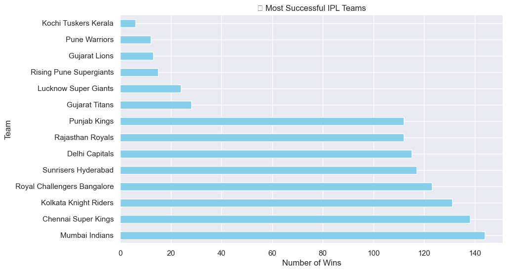
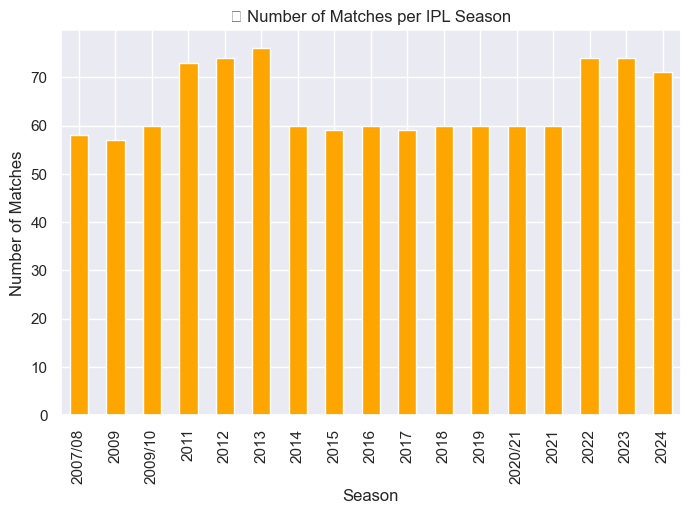
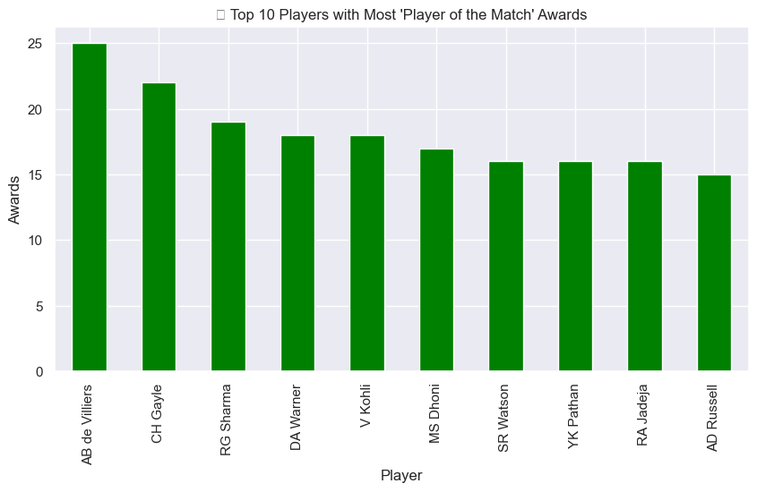
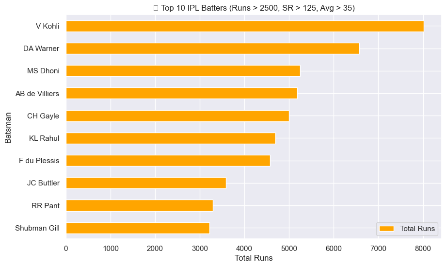
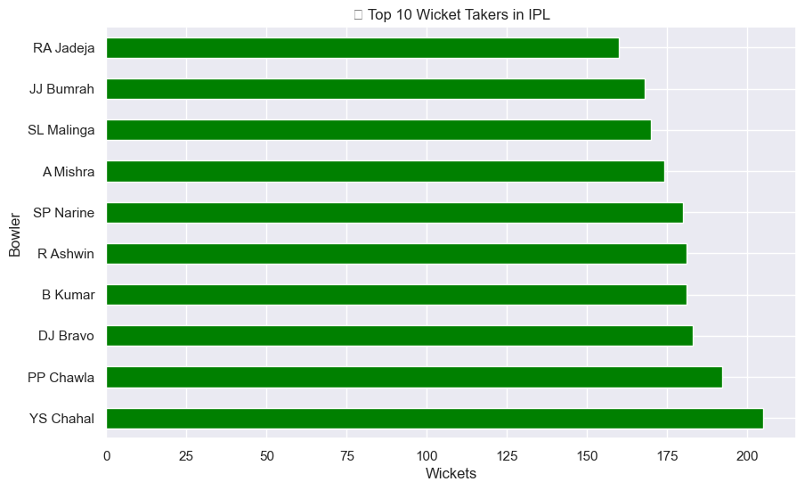
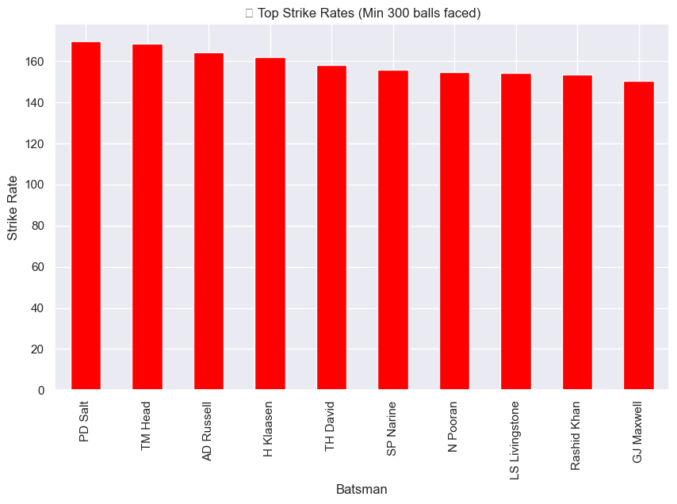

# 🏏 IPL EDA Analysis (2008–2024)

A detailed Exploratory Data Analysis of IPL matches from 2008 to 2020 using Python libraries like Pandas, Matplotlib, and Seaborn.

---

## 📁 Dataset

- Source: [IPL Dataset on Kaggle](https://www.kaggle.com/datasets/patrickb1912/ipl-complete-dataset-20082020)
- Files used:
  - `matches.csv` – Match-level stats
  - `deliveries.csv` – Ball-by-ball data

---

## ⚙️ Tools Used

- Python 3.x
- Jupyter Notebook / VS Code
- Pandas, NumPy
- Matplotlib, Seaborn

---

## 📊 Analysis Sections

### 🔹 Team-Level Insights
- 🏆 Most Successful Teams
- 📅 Matches Per Season
- 🌟 Player of the Match Winners
- 🧭 Toss Impact





### 🔹 Player-Level Insights
- 💣 Most Six Hitters
- 🎯 Top Wicket Takers
- ⚡ Strike Rate vs Average
- 👑 Top Run Scorers with Custom Filter: Players with
  - 2500+ Runs
  - SR > 125
  - Avg > 35





## 📈 Key Findings

- ✅ **Mumbai Indians** and **Chennai Super Kings** emerged as the most consistent and successful franchises across all seasons.
- 🧠 **Toss winners** had a slight edge in match outcomes, indicating a moderate influence of toss decisions.
- 💣 Certain players like **Chris Gayle**, **AB de Villiers**, and **Andre Russell** stood out for their high strike rates and six-hitting abilities.
- 👑 **Virat Kohli** leads in total runs, showcasing consistency, but doesn't appear in high strike-rate filters — proving that aggression ≠ greatness.
- 🎯 Bowlers like **Lasith Malinga** and **DJ Bravo** dominated in terms of total wickets and clutch performances.
- 📅 The number of matches per season fluctuated slightly — especially lower during COVID-affected seasons (e.g., 2020).
- 🔥 Several young players have emerged with explosive performance patterns, but need more seasons to build career stats.
- 🧪 Statistical filters help uncover niche performance groups (e.g., aggressive + consistent batsmen), but can hide legends — data always needs context.


---

## 🚀 Run Locally

```bash
git clone https://github.com/CallMeChandler/IPL-EDA-Project.git
cd IPL-EDA
pip install -r requirements.txt
jupyter notebook

Made with ❤️ by Aakarsh Agarwal

